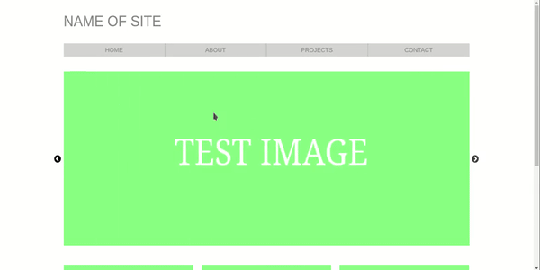

# Website Template

Simple website made with React.js, HTML and CSS. It also uses [react-slick](https://react-slick.neostack.com/) as image slider and [react-router](https://reacttraining.com/react-router/web/guides/quick-start) for navigation between pages.

## Prerequisites

Install [node.js](https://nodejs.org/en/) and [npm](https://www.npmjs.com/).

## Getting Started

#### Clone repository:

`git clone https://github.com/IselDrew/Website-template.git`

#### Install dependencies:

`npm install`

#### Start application:

`npm start`

## Application preview

